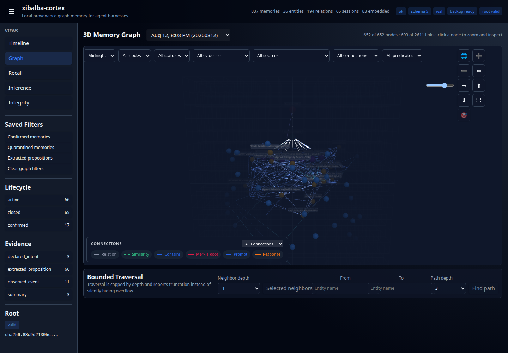
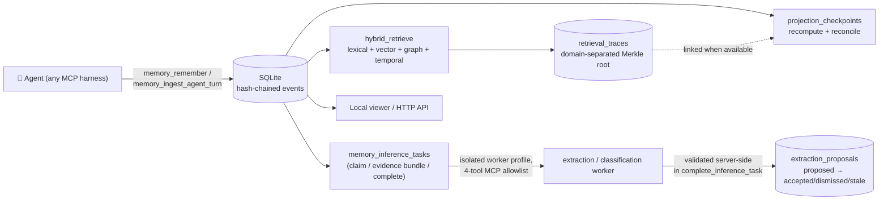
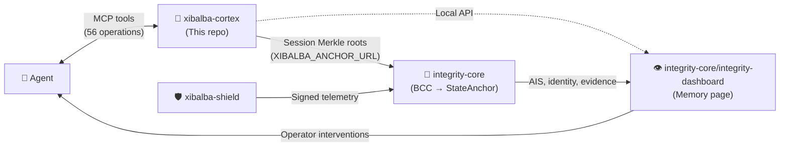

# Xibalba Cortex

**A provenance-aware graph memory MCP server for AI agent harnesses — every fact linked to its source, every extraction reviewable before it's trusted, every trace cryptographically verifiable.**

**Hash-Chained Provenance · Hybrid Retrieval · Reviewable Extraction · Isolated Inference Workers · Merkle-Verifiable Traces · MCP-Native**

```bash
uv sync
uv run xibalba-cortex
```

---



*Real headless-Chromium capture of the local viewer's populated knowledge graph — nodes, evidence-linked edges, session context, filters, bounded traversal controls. Captured 2026-08-12; graph contents are profile-dependent.*

---

Most agent memory systems store embeddings, not evidence: a similarity match with no way to prove where it came from, no record of what an extraction pass claimed versus what a human actually accepted, and no way to tell a regulator "this record hasn't been altered since it was written" — only to assert it. For an agent whose actions touch anything regulated, that gap is the difference between a memory system and an audit trail.

Cortex sits underneath your agent harness as a local Model Context Protocol server: it stores prompts, full model responses, tool calls, and graph edges with hash-chained events and Merkle-anchored session roots, fuses lexical/vector/graph/temporal retrieval into a single persisted and re-verifiable trace, and routes structured extraction through an isolated worker whose output lands as a reviewable proposal — never a silent write — before anything durable is derived from it.

**Who it's for:**

- **Agent-harness integrators** who need a memory layer that survives "why did the agent believe that" months later, not just a vector index that answers "what's similar."
- **Compliance and audit reviewers** who need to retrieve exactly what an agent did, down to the second, without trusting the agent's own self-report.
- **Healthcare and finance verticals** where "did the agent touch a regulated record, and when" has to be independently verifiable, not just logged.
- **Anyone building on the Integrity Protocol ecosystem** — Cortex is the cognitive store that anchors session evidence into the broader trust backbone (see [Ecosystem Role](#ecosystem-role) below), but works standalone with any MCP-speaking harness.

**[Quick Start](#quick-start)** · **[Why Cortex](#why-cortex)** · **[Architecture](#architecture)** · **[Provenance & Evidence](#provenance--evidence)** · **[Hybrid Retrieval](#hybrid-retrieval-with-verifiable-traces)** · **[Reviewable Extraction](#reviewable-extraction-pipeline)** · **[Recipe](#recipe-verifiable-entity-extraction-from-a-session)** · **[MCP Operations](#mcp-operations)** · **[CLI](#cli)** · **[Ecosystem Role](#ecosystem-role)**

## Why Cortex

| | Plain vector-store agent memory | **Xibalba Cortex** |
| --- | --- | --- |
| **Recall method** | Embedding similarity only | Lexical + vector + graph + temporal, fused with Reciprocal Rank Fusion |
| **Provenance** | None | Every memory carries `content_hash`, signed source, evidence class |
| **Extraction review** | Auto-written, or not tracked at all | Proposal lifecycle: `proposed → accepted/dismissed/stale`, never auto-applied |
| **Tamper evidence** | None | Hash-chained events, domain-separated Merkle roots, verifiable inclusion proofs |
| **Retrieval auditability** | Not persisted | Every query persists a full trace: per-channel ranks, RRF params, candidate pool sizes, graph edges |
| **Worker isolation** | N/A (no extraction step) | Extraction runs under a restricted Hermes profile — no default-agent memory/context leakage into evidence |
| **Consistency verification** | N/A | Projection checkpoints recompute from canonical SQLite and flag drift, not just assert it |

Cortex doesn't replace your agent harness's own memory or your vector store choice — it's the provenance and evidence layer underneath, MCP-native so any harness that speaks the protocol gets it for free.

## Quick Start

```python
# Store a memory with explicit, checkable provenance
memory = memory_remember(
    content="Patient record #4471 was reviewed for eligibility.",
    source={"kind": "direct_model_response", "locator": "hermes://session/abc/exchange/12"},
    evidence_class="observed_event",
)
# → {"id": "...", "content_hash": "sha256:...", "status": "candidate", ...}

# Recall is fused, ranked, and traced -- not just a similarity lookup
result = memory_hybrid_retrieve("eligibility review", limit=5)
trace = memory_retrieval_trace(result["trace_id"])
# → trace["rrf_params"], trace["candidate_pool_sizes"], per-result trace["results"][i]["channels"]

# Every trace result is independently, cryptographically checkable (Python store API today;
# an MCP wrapper for this is planned but not yet built)
proof = store.retrieval_trace_evidence(result["trace_id"], rank=1)
# → verify_domain_merkle_proof(proof) is True, without trusting the trace blob as a whole
```

Real tool/method signatures, verified against `src/xibalba_cortex/server.py` and `src/xibalba_cortex/store.py` — `memory_remember`/`memory_hybrid_retrieve`/`memory_retrieval_trace` are live MCP tools; `retrieval_trace_evidence` is called on a `GraphStore` instance directly until its own MCP wrapper lands.

## Architecture

The store schema, hash-chain/Merkle model, and core MCP tool contract are **frozen for v1** as of 2026-08-12 — see [`SPECIFICATION.md`](SPECIFICATION.md) §0 for what's frozen versus open, and the full [Goals and Milestones](SPECIFICATION.md#11-goals-and-milestones) list. Full detail lives in the [wiki](docs/wiki/index.md).



See [Ecosystem Role](#ecosystem-role) for how this connects to `integrity-core` and `xibalba-shield`.

## Provenance & Evidence

Every memory carries a `content_hash`, a signed `source` (kind, locator, observed_at), and an `evidence_class` — never just raw text. Mutating operations (`memory_supersede`, `memory_forget`) never silently rewrite history: superseded memories keep their chain, and forgetting removes user-visible content while retaining a residual tamper-evidence hash (see [`docs/operations/store-contract.md`](docs/operations/store-contract.md)).

Session-level integrity is a real hash chain, not a label: every event carries a `previous_hash`, `memory_verify_chain`/`memory_verify_exchange_chain` walk it and report the first break, and `memory_session_merkle_root` plus `memory_anchor_session_root` let a session's evidence be committed and, if `XIBALBA_ANCHOR_URL` is configured, anchored into `integrity-core`'s BCC middleware.

## Hybrid Retrieval With Verifiable Traces

`hybrid_retrieve` fuses four channels — lexical (FTS5/BM25), vector (cosine, caller-supplied embeddings), graph (1-hop neighbor expansion from query terms), and temporal (`temporal_at` filtering) — via Reciprocal Rank Fusion, and persists a full trace of the fusion itself, not just the final ranked list:

- Per-channel **rank and raw score** for every result, not just channel-membership booleans
- Pre-fusion **candidate pool sizes** per channel (discarded by most systems after fusion)
- The **RRF parameters actually used** (`k`, per-channel weights) — never a hidden constant
- **Graph edges**, not just "this result came from the graph channel" — predicate, object, seed term
- A **domain-separated, order-sensitive Merkle root** (`xibalba.retrieval_trace.v1`) over per-result leaves, so `retrieval_trace_evidence(trace_id, rank=N)` returns an inclusion proof any caller can verify independently — no trust in the stored trace blob required.

## Reviewable Extraction Pipeline

Structured extraction (`extract_entities`, `extract_relations`, PARA classification) runs through a dedicated worker profile — a real, separate Hermes profile (`scripts/setup-cortex-worker-profile.sh` installs it) restricted to an explicit 4-tool MCP allowlist, with `memory.memory_enabled: false` and no `plugins` attached, so the extraction agent cannot pull the default agent's own recalled memory or context into what it treats as evidence. This isolation is live-verified, not just configured: a leak-probe prompt against the restricted profile returns `[]`.

Output never writes directly. `complete_inference_task` validates schema, input-snapshot hash, and evidence-quote containment **server-side**, so validation gates completion regardless of which caller — in-process code or the isolated worker itself over MCP — invokes it. A passing extraction lands as one or more `extraction_proposals` rows in `proposed` state; `decide_extraction_proposal` accepts or dismisses, re-checking the source memory's current hash and refusing (→ `stale`) if it's diverged since the proposal was generated. Acceptance only ever inserts new derived records — it never mutates the source memory.

## Recipe: Verifiable Entity Extraction From a Session

```python
memory = memory_remember(
    content="Xibalba Solutions LLC operates the Integrity Protocol trust backend.",
    source={"kind": "direct_model_response", "locator": "hermes://session/abc/exchange/3"},
)

task = memory_request_inference(
    task_type="extract_entities", subject_type="memory", subject_id=memory["id"],
    input_payload={"source_content_hash": memory["content_hash"]},
)

# The isolated worker profile claims the task, reads only its bounded evidence bundle,
# and completes it -- all three calls go through the same 4-tool MCP allowlist:
claimed = memory_claim_inference_task(task["id"], claimed_by="xibalba-cortex-worker")
bundle = memory_evidence_bundle(task["id"])
memory_complete_inference_task(
    task["id"], claimed_by="xibalba-cortex-worker", claim_token=claimed["claim_token"],
    output_payload={...},  # validated server-side before this ever lands as a proposal
)

# A human reviews before anything is trusted. Today this is the Python store API --
# MCP/REST wrapping for proposal review is planned but not yet built (see docs/plans/):
proposals = store.list_extraction_proposals(status="proposed", task_id=task["id"])
store.decide_extraction_proposal(proposals[0]["id"], decision="accept", decided_by="operator")
```

## Features at a Glance

| Capability | Highlights |
| --- | --- |
| **Provenance** | `content_hash` + signed source + evidence_class on every memory; hash-chained events; residual-hash forgetting |
| **Session Integrity** | Hash-chain verification, session Merkle root, optional anchoring into `integrity-core` |
| **Hybrid Retrieval** | Lexical + vector + graph + temporal fusion; persisted RRF params, candidate pools, per-channel ranks |
| **Retrieval Trace Verification** | Domain-separated Merkle root per trace; per-result inclusion proofs via `retrieval_trace_evidence` |
| **Extraction Worker Isolation** | Dedicated restricted Hermes profile; 4-tool MCP allowlist; live-verified leak probe |
| **Extraction Proposal Lifecycle** | `proposed/accepted/dismissed/stale`; stale-hash rejection; never mutates source memory |
| **Projection Checkpoints** | Recompute from canonical SQLite; reconciliation persisted; mismatches marked `degraded`, never silently served |
| **Graph** | Entity/relation storage, bounded neighbor/path traversal, contradiction marking |
| **Transports** | stdio (local harness) and authenticated streamable-HTTP (cloud-hosted harness) |
| **MCP Surface** | 56 tools — memory, session, runtime-bridge, and inference-task operations |

## Installation and Tests

```bash
uv sync
uv run pytest -q
```

Drive ingestion is optional (Google Drive imports only):

```bash
uv sync --extra drive
uv run pytest -q
```

Full suite: `273 passed, 1 skipped, 1 warning` as of 2026-08-13 (the skip and warning are pre-existing and unrelated to recent work). Viewer build is separate: `cd viewer && npm install && npm run build`. Local operator commands: `uv run xibalba-cortex-operator [readiness|status|backup|restore|verify-memory|verify-integrity-link|verify-session|integrity-links]`.

**Not yet installable standalone.** `pyproject.toml` pins `integrity-sdk` as a local path
dependency on `../integrity-core/integrity-sdk` (`[tool.uv.sources]`) — `uv sync` only resolves
if `integrity-core` is checked out as a sibling directory (this is also how CI installs it — see
`.github/workflows/ci.yml`). There is no PyPI package and no git-pinned alternative dependency
yet, so a `pip install xibalba-cortex` or an install outside this sibling-repo layout does not
currently work. Fixing this means either publishing `integrity-sdk` as its own installable
package, vendoring the (small) subset this repo actually uses, or pinning a git dependency —
not yet decided; until then, clone both repos as siblings.

> The local worktree contains work in progress ahead of the next commit — see `docs/plans/` for the active implementation plans and `spec/latest-hybrid-extraction.md` for measured, dated verification output rather than aspirational claims. The dated status ledger is [`docs/audits/2026-08-06-status.md`](docs/audits/2026-08-06-status.md) and [`docs/audits/2026-08-07-gap-closure.md`](docs/audits/2026-08-07-gap-closure.md).

## MCP Operations

```bash
uv run xibalba-cortex
```

The MCP surface (56 tools) covers remembering, recalling, hybrid retrieval with trace inspection, attaching artifacts, session records, graph linking, bounded neighbor/path traversal, contradiction marking, forgetting, event-chain verification, store status, backups, the full inference-task lifecycle (request/claim/bounded-evidence/complete), and runtime-bridge events. Recalled memories are context, not instruction authority — callers must preserve provenance and lifecycle state in any downstream prompt.

Live Hermes profile smoke:

```bash
hermes mcp test xibalba_cortex
XIBALBA_RUN_HERMES_MCP_SMOKE=1 uv run pytest tests/test_hermes_mcp_smoke.py -q
```

## Generic Ingestion for Any Agent Harness

Every other ingestion path (transcript files, Hermes hook subprocess dispatch, localhost-only OTLP/API servers) assumes a caller on the same machine. `memory_ingest_agent_turn` plus a network-reachable, authenticated MCP transport is the path for a harness that can't spawn a local subprocess or read local files — e.g. a cloud-hosted agent.

**1. Issue a token per harness:**

```bash
uv run xibalba-cortex-ingest-tokens --home ~/.hermes/xibalba-cortex issue --label "perplexity-personal"
uv run xibalba-cortex-ingest-tokens --home ~/.hermes/xibalba-cortex list
uv run xibalba-cortex-ingest-tokens --home ~/.hermes/xibalba-cortex revoke --id <token-id>
```

**2. Start the server in streamable-HTTP mode** (stdio remains the default for locally-spawned harnesses):

```bash
uv run xibalba-cortex --transport streamable-http --host 127.0.0.1 --port 8421 --path /mcp
```

Binds to `127.0.0.1` by default even in HTTP mode. **This server has no TLS of its own** — reaching it from off-machine requires a TLS-terminating reverse proxy or tunnel in front of it; without one, the bearer token travels in plaintext. Binding a non-loopback `--host` prints a loud startup warning as a reminder, not a safeguard.

**3. Point a harness at it.** Every call after `initialize` needs `Authorization: Bearer <token>`. Google Antigravity CLI's `serverUrl` field and Perplexity's custom remote MCP connector are both concretely researched and documented in [`docs/wiki/`](docs/wiki/index.md).

**4. One call captures a complete turn.** `memory_ingest_agent_turn(external_session_id, runtime, prompt, response, tool_calls=[...], ...)` — `runtime` is a free string, not a fixed harness allowlist. Everything is redacted for likely secrets before storage (`redaction.py`), and every call wraps the same hash-chained exchange/Merkle-root guarantees as local ingestion.

## Claude Code Integration

To route Claude Code's `pre_tool_call` hooks into graph memory, configure `scripts/claude_pre_tool_hook.js` in your `~/.claude.json` or load it via Claude Code's extension mechanism to forward telemetry.

## CLI

Every operational surface ships as a `uv run` console script, no separate install:

```bash
uv run xibalba-cortex                        # MCP server (stdio or streamable-HTTP)
uv run xibalba-cortex-operator <command>      # readiness, status, backup, restore, verification
uv run xibalba-cortex-embedding-worker        # backfill/re-embed memory vectors, out-of-process
uv run xibalba-cortex-para-worker             # PARA classification worker
uv run xibalba-cortex-ingest-tokens <command> # issue/list/revoke bearer tokens for remote ingestion
uv run xibalba-cortex-session-sync            # session synchronization
uv run xibalba-cortex-transcript-ingest       # ingest transcript files
uv run xibalba-cortex-demo-seed               # deterministic demo data
```

## Ecosystem Role

Cortex works standalone as a generic MCP memory server with any MCP-speaking agent — the generic ingestion path above means Claude Code, Codex, Antigravity CLI, or a cloud-hosted harness can all record turns into the same store with zero code change here per new harness. It is also the cognitive store in a three-repository ecosystem:

| Repository | Analogy | Role |
|---|---|---|
| **`xibalba-cortex`** | 🧠 The Brain | Local cognitive store — memories, context, reasoning provenance, session Merkle roots |
| `xibalba-shield` | 🛡️ The Immune System | Endpoint enforcement, kernel sensing, policy gating, semantic guardrails |
| `integrity-core` | 🦴 The Backbone + 👁️ Control Center | On-chain identity, BCC, Oracle scoring, smart contracts, plus the operator dashboard |



Anchoring is opt-in: set `XIBALBA_ANCHOR_URL` and call `memory_anchor_session_root` manually, or set `XIBALBA_AUTO_ANCHOR_ON_SESSION_END=1` to anchor automatically on session close (anchor failures never block session teardown). See [`integrity-core/docs/architecture/ecosystem-dependencies.md`](https://github.com/XibalbaTechSol/integrity-core/blob/main/docs/architecture/ecosystem-dependencies.md) for ownership boundaries.

## Privacy and Retention

The store is local SQLite under the configured profile home. Agent identity is controlled by `XIBALBA_CORTEX_IDENTITY_MODE`: `pseudonymous` by default, `full` for raw agent IDs, `omit` for none. Forgetting removes user-visible content while retaining a residual tamper-evidence hash — see [`docs/operations/store-contract.md`](docs/operations/store-contract.md).

## Goals and Milestones

Cortex's north star: give any AI agent harness a place to record what it did, with enough provenance and fidelity that a compliance reviewer can retrieve exactly what happened down to the second, without trusting the agent's own self-report — the recurring need behind "did the agent touch a regulated record, and when."

- **Complete capture, not sampling** — full prompt, response, and every tool call, not a summary.
- **Provenance an auditor can trust** — hash-chained events and Merkle roots make "this record hasn't been silently edited" verifiable, not just asserted.
- **Untrusted-by-default retrieval** — recalled memory is context, never instruction authority.

Covered today: local hash-chain/Merkle store, generic MCP tool surface, two transports, redaction on every ingestion path, per-harness bearer-token auth, isolated extraction workers with a reviewable proposal lifecycle, verifiable retrieval traces, and projection checkpoint/reconciliation. Deferred — real-time streaming queries, multi-tenant profile-sharing, automatic (not opt-in) anchoring, and a documented finance/healthcare audit-framework mapping. See [`SPECIFICATION.md`'s §11](SPECIFICATION.md#11-goals-and-milestones) for the full breakdown of what's deliberately left open rather than silently claimed.
