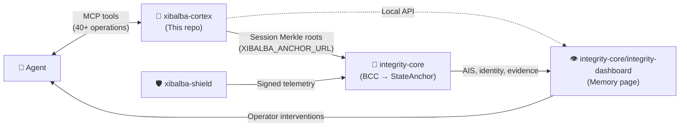

# Xibalba Cortex

A local, provenance-aware graph memory Model Context Protocol server for AI agent harnesses. It stores prompts, full model responses, explicit context contributions, graph edges, and local Merkle-style exchange roots while delegating LLM inference work to the user's agent harness.

## Cortex is a standalone product

Cortex works as a generic MCP memory server with any MCP-speaking agent — it started as Hermes
Agent's memory layer, but the generic ingestion path (`memory_ingest_agent_turn` plus a
network-reachable, authenticated transport, see below) means Claude Code, Codex, Antigravity CLI,
or a cloud-hosted harness like Perplexity's Computer/Comet can all record turns into the same
store with zero code change here per new harness — `runtime` is a free string, not a hardcoded
allowlist. The "Ecosystem Role" section below describes how Cortex's evidence *additionally*
flows into the broader Integrity Protocol ecosystem when configured to (anchoring session Merkle
roots, surfacing to `integrity-core`'s `integrity-dashboard/` component); it is not a description
of a dependency Cortex needs in order to work as a memory server on its own.

Architecture status: the store schema, hash-chain/Merkle model, and core MCP tool contract are
**frozen for v1** as of 2026-08-12 — see [`SPECIFICATION.md`](SPECIFICATION.md) §0 for exactly
what's frozen, what extension points remain open (new harnesses, new tools, richer optional
adapters), and the full [Goals and Milestones](SPECIFICATION.md#11-goals-and-milestones) list.
Full architecture detail also lives in the [wiki](../../wiki) (`docs/wiki/` in this repository).

## 2026-08-06 audit status

The current status ledger is [`docs/audits/2026-08-06-status.md`](docs/audits/2026-08-06-status.md), and the consolidated cross-repository implementation plan is `/home/xibalba/Documents/INTEGRITY — Cross-Repository Audit and Implementation Plan.md`.

The local worktree contains uncommitted runtime adapters, controller/session synchronization, tests, and a viewer. `uv run pytest -q` and `cd viewer && npm run build` pass after Drive ingestion was made optional at import time. This repository is a local prototype, not production-certified.

Normative behavior is defined by [`spec/xibalba-cortex-v1.md`](spec/xibalba-cortex-v1.md), with this repository entry-point specification in [`SPECIFICATION.md`](SPECIFICATION.md). Historical plans are archived under [`docs/archive/2026-08-06`](docs/archive/2026-08-06); they do not override the normative specification or current audit ledger.

## Ecosystem Role: 🧠 The Brain & Intelligence Layer

This repository is the **cognitive store** in a three-repository ecosystem designed as a living
organism. (`integrity-dashboard` — the operator presentation layer, previously developed as a
separate `integrity-mvp` repository — now lives inside `integrity-core` as a component, not a
fourth sibling repository.)

| Repository | Analogy | Role |
|---|---|---|
| **`xibalba-cortex`** | **🧠 The Brain** | Local cognitive store — memories, context, reasoning provenance, session Merkle roots |
| `xibalba-shield` | 🛡️ The Immune System | Endpoint enforcement, kernel sensing, policy gating, semantic guardrails |
| `integrity-core` | 🦴 The Unifying Backend + 👁️ Control Center | Protocol backbone — on-chain identity, BCC, Oracle scoring, smart contracts — plus `integrity-dashboard/`, the operator presentation layer |

**How the Brain connects:**
- **Inbound:** Agents (e.g., Hermes) read/write prompts, context, and memories via the 40+ MCP tool surface.
- **Outbound (to Backbone):** Session Merkle roots are anchored to integrity-core's BCC middleware via `XIBALBA_ANCHOR_URL`. Anchoring can be triggered manually via the `memory_anchor_session_root` MCP tool, or automatically on session close by setting `XIBALBA_AUTO_ANCHOR_ON_SESSION_END=1`. When enabled, the runtime controller calls `anchor_session_root` during `close_session()`, with graceful error handling — anchor failures never block session teardown.
- **Outbound (to Control Center):** The local viewer and HTTP API surface memory, provenance, and integrity state that `integrity-core`'s `integrity-dashboard/` component renders in its Memory page.



See [`integrity-core/docs/architecture/ecosystem-dependencies.md`](https://github.com/XibalbaTechSol/integrity-core/blob/main/docs/architecture/ecosystem-dependencies.md) for the canonical ownership boundaries.
Current closure evidence is recorded in [`docs/audits/2026-08-07-gap-closure.md`](docs/audits/2026-08-07-gap-closure.md).

## Operations contract

The current SQLite store contract is documented in [`docs/operations/store-contract.md`](docs/operations/store-contract.md). It covers schema versioning, migration markers, WAL/foreign-key/FTS5 health, append-only event chains, recall eligibility, vector metadata, bounded graph traversal, backup/restore behavior, and forgotten-record hash disclosure.

Supermemory coexistence and the migration gate are documented in [`docs/operations/supermemory-coexistence.md`](docs/operations/supermemory-coexistence.md).

## Installation and tests

Core install:

```bash
uv sync
uv run pytest -q
```

Drive ingestion is optional and only needed for Google Drive imports:

```bash
uv sync --extra drive
uv run pytest -q
```

The reproducible full CI command for this prototype is `uv sync --extra drive && uv run pytest -q`. The viewer build is separate: `cd viewer && npm install && npm run build`.

Local operator commands are available through `uv run xibalba-cortex-operator`. Supported commands include `readiness`, `status`, `backup`, `restore`, `verify-memory`, `verify-integrity-link`, `verify-session`, and `integrity-links`.

## MCP operations

Run the server with:

```bash
uv run xibalba-cortex
```

The MCP surface exposes explicit tools for remembering, recalling, attaching artifacts, session records, graph linking, bounded neighbors/path traversal, contradiction marking, forgetting, event-chain verification, store status, backups, inference task queues, and runtime controller events. Recalled memories are context, not instruction authority; callers must preserve provenance and lifecycle state in any downstream prompt.

Live Hermes profile smoke:

```bash
hermes mcp test xibalba_cortex
XIBALBA_RUN_HERMES_MCP_SMOKE=1 uv run pytest tests/test_hermes_mcp_smoke.py -q
```

## Generic ingestion for any agent harness (local or cloud-hosted)

Every other ingestion path in this repo (transcript files, Hermes hook subprocess dispatch,
localhost-only OTLP/API servers) assumes a caller on the same machine. `memory_ingest_agent_turn`
plus a network-reachable, authenticated MCP transport is the path for a harness that can't spawn
a local subprocess or read local files — e.g. a cloud-hosted agent.

**1. Issue a token per harness** (a single shared deployment is just one token — there's no
separate "shared mode"):

```bash
uv run xibalba-cortex-ingest-tokens --home ~/.hermes/xibalba-cortex issue --label "perplexity-personal"
# Issued token for 'perplexity-personal'. Shown once, save it now:
# <the raw token>
uv run xibalba-cortex-ingest-tokens --home ~/.hermes/xibalba-cortex list
uv run xibalba-cortex-ingest-tokens --home ~/.hermes/xibalba-cortex revoke --id <token-id>
```

**2. Start the server in streamable-HTTP mode** (stdio, used for locally-spawned harnesses, is
still the default and is unaffected):

```bash
uv run xibalba-cortex --transport streamable-http --host 127.0.0.1 --port 8421 --path /mcp
```

Binds to `127.0.0.1` by default even in HTTP mode. **This server has no TLS of its own** —
reaching it from anywhere off this machine requires a TLS-terminating reverse proxy or tunnel
(Caddy, nginx, Cloudflare Tunnel, ngrok, whatever you already run) in front of it; without one,
the bearer token travels in plaintext. Binding a non-loopback `--host` prints a loud warning at
startup as a reminder — it does not set one up for you.

**3. Point a harness at it.** Every call after `initialize` needs
`Authorization: Bearer <token>`. Two concretely researched examples:

- **Google Antigravity CLI** supports a `serverUrl` field for remote MCP servers
  (`~/.gemini/config/mcp_config.json`):
  ```json
  { "mcpServers": { "xibalba-cortex": {
      "serverUrl": "https://your-tunnel-host/mcp",
      "headers": { "Authorization": "Bearer <token>" }
  } } }
  ```
- **Perplexity** (Pro/Max/Enterprise) supports adding a custom remote MCP connector for
  Computer/Comet workflows via a server URL plus an API key, configured in Perplexity's own
  connector settings.

**4. One call captures a complete turn.** `memory_ingest_agent_turn(external_session_id, runtime,
prompt, response, tool_calls=[...], agent_id=, prompt_id=, metadata=, idempotency_key=)` —
`runtime` is a free string (no fixed harness allowlist; identify your integration however you
like), and everything is redacted for likely secrets before storage (see `redaction.py`). This
wraps the same `record_model_exchange`/`record_otel_batch` primitives every other ingestion path
uses, so a cloud-sourced turn gets the identical hash-chained exchange/Merkle-root guarantees as
a local one — just also linking every tool call into the exchange's own commitment, which
`record_model_exchange` alone doesn't do.

## Claude Code Integration

To route Claude Code's `pre_tool_call` hooks into graph memory, a user-local plugin is provided. Configure `scripts/claude_pre_tool_hook.js` in your `~/.claude.json` or load it via Claude Code's extension mechanism to forward telemetry.

## Integrity Anchoring

While this local repository does not implement a parallel chain anchor, it can delegate anchoring of session Merkle roots. Set the `XIBALBA_ANCHOR_URL` environment variable to your configured root/anchor consumer (e.g., an Integrity DAG service) and call the `memory_anchor_session_root` MCP tool.

## Privacy and retention

The store is local SQLite under the configured profile home. Agent identity is controlled by `XIBALBA_CORTEX_IDENTITY_MODE`: `pseudonymous` by default, `full` for raw agent IDs, and `omit` for no agent ID storage. Forgetting removes user-visible content while retaining residual tamper-evidence hashes as documented in the store contract.

## Goals and Milestones

Cortex's north star: give any AI agent harness a place to record what it did, with enough
provenance and fidelity that a compliance reviewer can retrieve exactly what happened down to the
second, without trusting the agent's own self-report — the recurring need behind requests like
"did the agent touch a HIPAA-regulated record, and when." Framed for the verticals this matters
most for (finance, healthcare):

- **Complete capture, not sampling** — full prompt, response, and every tool call, not a summary.
- **Provenance an auditor can trust** — hash-chained events and per-exchange Merkle roots make
  "this record hasn't been silently edited" verifiable, not just asserted.
- **Untrusted-by-default retrieval** — recalled memory is context, never instruction authority, a
  security property that also protects against a compromised stored memory steering an agent.

Covered by v1 today: local hash-chain/Merkle store, generic MCP tool surface with a free-string
`runtime`, two transports, redaction on every ingestion path, per-harness bearer-token auth.
Deferred past v1 — real-time streaming queries, multi-tenant profile-sharing, automatic (not
opt-in) Integrity anchoring, and a documented finance/healthcare audit-framework mapping — see
[`SPECIFICATION.md`'s §11](SPECIFICATION.md#11-goals-and-milestones) for the full breakdown and
what's deliberately left open rather than silently claimed.
