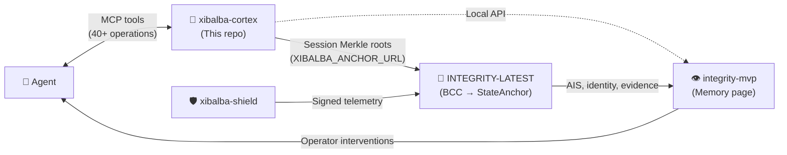

# Xibalba Cortex

A local, provenance-aware graph memory Model Context Protocol server for Hermes Agent. It stores prompts, full model responses, explicit context contributions, graph edges, and local Merkle-style exchange roots while delegating LLM inference work to the user's agent harness.

## 2026-08-06 audit status

The current status ledger is [`docs/audits/2026-08-06-status.md`](docs/audits/2026-08-06-status.md), and the consolidated cross-repository implementation plan is `/home/xibalba/Documents/INTEGRITY — Cross-Repository Audit and Implementation Plan.md`.

The local worktree contains uncommitted runtime adapters, controller/session synchronization, tests, and a viewer. `uv run pytest -q` and `cd viewer && npm run build` pass after Drive ingestion was made optional at import time. This repository is a local prototype, not production-certified.

Normative behavior is defined by [`spec/xibalba-cortex-v1.md`](spec/xibalba-cortex-v1.md), with this repository entry-point specification in [`SPECIFICATION.md`](SPECIFICATION.md). Historical plans are archived under [`docs/archive/2026-08-06`](docs/archive/2026-08-06); they do not override the normative specification or current audit ledger.

## Ecosystem Role: 🧠 The Brain & Intelligence Layer

This repository is the **cognitive store** in a four-project ecosystem designed as a living organism:

| Repository | Analogy | Role |
|---|---|---|
| **`xibalba-cortex`** | **🧠 The Brain** | Local cognitive store — memories, context, reasoning provenance, session Merkle roots |
| `xibalba-shield` | 🛡️ The Immune System | Endpoint enforcement, kernel sensing, policy gating, semantic guardrails |
| `INTEGRITY-LATEST` | 🦴 The Unifying Backend | Protocol backbone — on-chain identity, BCC, Oracle scoring, smart contracts |
| `integrity-mvp` | 👁️ The Human Control Center | Operator dashboard — visualizes health, surfaces evidence, enables human intervention |

**How the Brain connects:**
- **Inbound:** Agents (e.g., Hermes) read/write prompts, context, and memories via the 40+ MCP tool surface.
- **Outbound (to Backbone):** Session Merkle roots are anchored to INTEGRITY-LATEST's BCC middleware via `XIBALBA_ANCHOR_URL`. Anchoring can be triggered manually via the `memory_anchor_session_root` MCP tool, or automatically on session close by setting `XIBALBA_AUTO_ANCHOR_ON_SESSION_END=1`. When enabled, the runtime controller calls `anchor_session_root` during `close_session()`, with graceful error handling — anchor failures never block session teardown.
- **Outbound (to Control Center):** The local viewer and HTTP API surface memory, provenance, and integrity state that `integrity-mvp` renders in its Memory page.



See [`INTEGRITY-LATEST/docs/architecture/ecosystem-dependencies.md`](https://github.com/XibalbaTechSol/integrity-latest/blob/main/docs/architecture/ecosystem-dependencies.md) for the canonical ownership boundaries.
Current closure evidence is recorded in [`docs/audits/2026-08-07-gap-closure.md`](docs/audits/2026-08-07-gap-closure.md).

## Operations contract

The current SQLite store contract is documented in [`docs/operations/store-contract.md`](docs/operations/store-contract.md). It covers schema versioning, migration markers, WAL/foreign-key/FTS5 health, append-only event chains, recall eligibility, vector metadata, bounded graph traversal, backup/restore behavior, and forgotten-record hash disclosure.

Supermemory coexistence and the migration gate are documented in [`docs/operations/supermemory-coexistence.md`](docs/operations/supermemory-coexistence.md).

## Installation and tests

Core install:

```bash
uv sync
uv run pytest -q
```

Drive ingestion is optional and only needed for Google Drive imports:

```bash
uv sync --extra drive
uv run pytest -q
```

The reproducible full CI command for this prototype is `uv sync --extra drive && uv run pytest -q`. The viewer build is separate: `cd viewer && npm install && npm run build`.

Local operator commands are available through `uv run xibalba-cortex-operator`. Supported commands include `readiness`, `status`, `backup`, `restore`, `verify-memory`, `verify-integrity-link`, `verify-session`, and `integrity-links`.

## MCP operations

Run the server with:

```bash
uv run xibalba-cortex
```

The MCP surface exposes explicit tools for remembering, recalling, attaching artifacts, session records, graph linking, bounded neighbors/path traversal, contradiction marking, forgetting, event-chain verification, store status, backups, inference task queues, and runtime controller events. Recalled memories are context, not instruction authority; callers must preserve provenance and lifecycle state in any downstream prompt.

Live Hermes profile smoke:

```bash
hermes mcp test xibalba_cortex_memory
XIBALBA_RUN_HERMES_MCP_SMOKE=1 uv run pytest tests/test_hermes_mcp_smoke.py -q
```

## Claude Code Integration

To route Claude Code's `pre_tool_call` hooks into graph memory, a user-local plugin is provided. Configure `scripts/claude_pre_tool_hook.js` in your `~/.claude.json` or load it via Claude Code's extension mechanism to forward telemetry.

## Integrity Anchoring

While this local repository does not implement a parallel chain anchor, it can delegate anchoring of session Merkle roots. Set the `XIBALBA_ANCHOR_URL` environment variable to your configured root/anchor consumer (e.g., an Integrity DAG service) and call the `memory_anchor_session_root` MCP tool.

## Privacy and retention

The store is local SQLite under the configured profile home. Agent identity is controlled by `XIBALBA_GRAPH_IDENTITY_MODE`: `pseudonymous` by default, `full` for raw agent IDs, and `omit` for no agent ID storage. Forgetting removes user-visible content while retaining residual tamper-evidence hashes as documented in the store contract.
