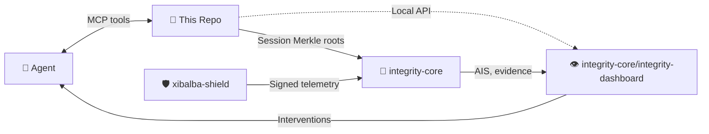

# Xibalba Cortex Repository Specification

**Updated:** 2026-08-13
**Status:** Local provenance-aware MCP memory prototype; not production-certified.

## 0. Architecture Status: v1 (frozen)

As of 2026-08-12, the store schema (§4), the hash-chain/Merkle model (§3, §4), and the MCP tool
contract's core primitives (§5) are **frozen for v1**: existing tools keep their current
signatures and semantics, and existing table shapes don't change field meaning. This is a
deliberate stability commitment, made because Cortex is a standalone product other harnesses
integrate against — a breaking change to `record_model_exchange`'s shape, for example, would
break every existing integration silently.

Freezing v1 does not mean the surface stops growing. Three extension points are explicitly
**not** frozen, and are exactly where v1 growth is expected to happen without touching the frozen
core:

1. **`runtime` stays a free string everywhere it appears.** A brand-new agent harness integrates
   with zero schema or code change here — this is what the 2026-08-12 generic-ingestion work
   (`memory_ingest_agent_turn`, streamable-HTTP transport) already proved, not a future promise.
2. **New MCP tools may be added freely.** The tool surface has grown from an initial set to 40+
   tools across this project's history without breaking an existing caller; that pattern
   continues. A new tool is additive by construction — it cannot retroactively change what an
   existing tool does.
3. **The runtime-controller/adapter layer (claude/agy/codex) is an optional richer layer on top
   of the frozen generic primitives, not part of the frozen surface itself.** It may grow new
   adapters, richer identity binding, or new policy-evaluation hooks without touching §4's store
   schema or §5's generic tool contract — those adapters call the same frozen
   `record_model_exchange`/`record_otel_batch` primitives every other ingestion path uses.

What "frozen" does NOT cover: operational surfaces (viewer, CLI operator commands, backup/restore
mechanics) may still change; those are implementation details, not the integration contract other
harnesses depend on. A breaking change to anything actually frozen above requires a v2 or an
explicit migration note, per §10's Acceptance Criteria and this document's revision discipline.

## 1. Purpose

xibalba-cortex provides local, profile-isolated, provenance-aware graph memory for Xibalba runtimes. It stores sources, memories, events, entities, relations, contradictions, and integrity links without treating recalled text as instruction authority.

The detailed normative model is `spec/xibalba-cortex-v1.md`. This root specification is the repository entry-point contract for implementation, operations, and integration boundaries.

## 2. Authority

| Document | Role |
|---|---|
| README.md | Repository overview and current operational status. |
| SPECIFICATION.md | Root implementation and integration specification. |
| IMPLEMENTATION_PLAN.md | Closed/planned/blocked implementation ledger. |
| spec/xibalba-cortex-v1.md | Normative memory-system specification. |
| docs/audits/2026-08-06-status.md | Current audit evidence and packaging findings. |
| docs/archive/2026-08-06/2026-08-05-xibalba-cortex.md | Historical implementation sequence. |
| docs/archive/2026-08-06/2026-08-05-xibalba-runtime-adapter-checklist.md | Historical runtime adapter checklist. |
| [Wiki](../../wiki) (`docs/wiki/`) | Architecture concept pages, ecosystem role, compliance evidence trail — a core set, not exhaustive. |

## 3. Core Requirements

- SQLite is the canonical local store.
- Every memory has source provenance, content hash, derivation family, lifecycle status, and event history.
- Event transitions are append-only and hash-chain verifiable.
- Session exchanges expose a local Merkle-style root over prompt, response, tool, and context contribution hashes.
- Entity and relation edges are evidence-linked and bounded during traversal.
- Contradiction, supersession, quarantine, forgetting, and restoration must preserve auditable event history.
- Retrieval output is untrusted content and must never override system, developer, or user instructions.

## 4. Store Model

| Object | Required fields | Notes |
|---|---|---|
| Source | source id, origin, locator, content hash, captured time, profile | Raw evidence or imported artifact. |
| Memory | memory id, source id, text/value, epistemic class, lifecycle status, derivation family | Queryable unit of memory. |
| Event | event id, prior hash, event hash, actor/runtime, transition, timestamp | Append-only state transition. |
| Exchange | exchange id, session id, prompt/response memory links, context contribution links, parent/root node ids | Tamper-evident session turn structure. |
| Inference task | task id, task type, subject, input/output JSON, status | Harness-facing queue for LLM-derived summaries and metadata. |
| Entity | entity id, label, aliases, evidence links | Extracted or asserted node with provenance. |
| Relation | relation id, subject, predicate, object, confidence, evidence links | Bounded graph edge. |
| Integrity link | local object id, remote DAG or anchor reference, proof metadata | One-way citation boundary only. |

## 5. MCP And Runtime Contract

The MCP/controller surface should expose store, recall, full model-exchange capture, local session Merkle-root inspection, harness inference-task delegation, link, neighbors, path, contradict, forget, verify, status, and backup operations. Claude, agy, and Codex adapters must report their actual hook capabilities honestly. Missing pre-tool, post-tool, or lifecycle hooks are capability gaps, not hidden parity.

The server must support two transports: stdio (default, for a locally-spawned harness) and a
network-reachable streamable-HTTP transport (for a harness with no local filesystem/subprocess
access, e.g. a cloud-hosted agent). The generic ingestion entry point (`memory_ingest_agent_turn`)
must not require a fixed harness allowlist — `runtime` is a free string. Every request over the
HTTP transport must carry a valid per-harness bearer token (`ingest_tokens.py`); the transport
must default to binding loopback-only and must not silently accept a non-loopback bind without
warning that the underlying server has no TLS of its own.

## 6. Viewer Contract

The viewer should expose recall, graph traversal, provenance, contradiction, forgetting, lifecycle status, and verification state. It must make untrusted-memory status visible and avoid presenting retrieved content as instruction authority.

## 7. Privacy And Operations

- Profile isolation is required.
- Backup and restore must preserve hash-chain verifiability.
- Forgetting must document residual hash disclosure and restore semantics.
- Drive ingestion dependencies must be either a supported default, optional extra, or cleanly skipped test group.
- MCP discovery should be verified through an isolated Hermes profile before operational use.
- Only a bearer token's hash is ever stored (`ingest_tokens.py`); the raw value is shown once at
  issuance and cannot be recovered later — rotation, not recovery, is the intended path.

## 8. Ecosystem Role: 🧠 The Brain & Intelligence Layer

This repository is the cognitive store in a three-repository ecosystem. It provides memories,
context, provenance, and session Merkle roots to the agent and anchors session evidence into the
protocol backbone. (`integrity-dashboard` — the operator presentation layer, previously developed
as a separate `integrity-mvp` repository — now lives inside `integrity-core` as a component, not
a fourth sibling repository.)

## 9. Integrity Boundary

This repository may cite future Integrity Memory DAG or protocol anchors. It must not implement a parallel chain anchor or claim that byte lineage proves truth, authorization, or completeness. Integrity links are evidence references, not protocol authority.

## 10. Acceptance Criteria

- Store can be created, migrated, backed up, restored, and verified.
- Tests pass under the documented install command.
- Optional Drive dependencies have deterministic test behavior.
- Runtime adapters and viewer changes are reviewed and committed as a clean baseline.
- README, SPECIFICATION, implementation plan, and v1 normative spec agree on status and boundaries.

## 11. Goals And Milestones

Cortex's north star: give any AI agent harness — local or cloud-hosted — a place to record what
it did, with enough provenance and fidelity that a compliance reviewer can retrieve exactly what
happened down to the second, without trusting the agent's own self-report. Framed for the
verticals this matters most for (finance, healthcare):

- **Complete capture, not sampling.** Prompt, response, every tool call, and timestamps for each
  — not a summary. `memory_ingest_agent_turn` and the transcript-ingestion paths both target this.
- **Provenance an auditor can trust.** Hash-chained events and per-exchange Merkle roots mean
  "this record hasn't been silently edited" is verifiable, not just asserted.
- **Untrusted-by-default retrieval.** Recalled memory is context, never instruction authority —
  a security property, not just a UX note, since a compromised or adversarial stored memory must
  never be able to redirect an agent's behavior on recall.

Milestones (v1 vs. explicitly deferred):

**Covered by v1 (frozen, §0):** local SQLite store with hash-chain/Merkle provenance; generic
MCP tool surface (40+ tools) with a free-string `runtime`; two transports (stdio, authenticated
streamable-HTTP); redaction on all ingestion paths; per-harness bearer-token auth with hash-only
storage; optional richer adapters for claude/agy/codex on top of the generic primitives.

**Deferred past v1, not started:**
1. Real-time streaming/subscription queries (a compliance dashboard watching live, not polling).
2. Multi-tenant profile-sharing for a compliance team (today's profile isolation is single-owner).
3. Automatic (not opt-in) Integrity Protocol anchoring of every session root — today's
   `XIBALBA_AUTO_ANCHOR_ON_SESSION_END` is real but off by default and requires a configured
   `XIBALBA_ANCHOR_URL`.
4. A documented mapping from Cortex's provenance model to specific finance/healthcare audit
   frameworks (SOC 2, HIPAA) — not started; requires domain expertise this repository does not
   itself claim.

## 12. Configurable Local And Hybrid Intelligence

Cortex remains a deterministic, profile-local evidence store. Intelligence is an additive,
provider-facing layer and must not change the authority of the canonical store.

### 12.1 Operating modes

The effective configuration selects one of these modes:

- **local** — SQLite is canonical, the native agent harness performs inference, and a local
  embedding worker produces versioned vector projections.
- **hybrid** — SQLite remains canonical while optional remote inference, vector, reranking, or
  backup services operate as rebuildable projections or explicitly configured providers.
- **remote-inference/local-embedding** — a remote inference provider is used by policy while
  source capture, embeddings, and provenance remain local.

Remote services must never become an independent authority for memories, events, graph edges,
or integrity evidence. A projection must be replayable from the canonical store and its lag,
errors, and reconciliation state must be observable.

### 12.2 Provider boundaries

New provider interfaces are additive and must preserve existing MCP and store signatures:

- `InferenceProvider` — submits or dispatches a typed task to the configured native harness or
  optional external provider; it cannot directly promote durable memory.
- `EmbeddingProvider` — produces vectors with model identifier, dimension, normalization, and
  revision metadata; it cannot write a vector without a source-content-hash compare-and-set.
- `RetrievalProvider` — produces lexical, vector, graph, or temporal candidates with a retrieval
  trace; it cannot bypass profile, namespace, lifecycle, or sensitivity filters.
- `ProjectionProvider` — mirrors canonical records to an optional external system and reports
  lag, failures, and reconciliation results; it is never authoritative.

Configuration precedence is built-in defaults, profile configuration, environment variables,
command-line flags, then explicit task/provider overrides. Effective configuration must be
inspectable with secrets redacted.

### 12.3 Native-harness inference

The preferred inference path is the user's native agent harness, such as Hermes, Claude Code,
Codex, or another MCP-speaking runtime. Cortex queues a task containing an explicit subject,
evidence scope, input snapshot hash, output schema, and promotion policy. The harness reads only
the task input and referenced evidence, returns schema-valid JSON, and completes through the
claim-owner and claim-token queue contract.

Inference output is a derived proposal. It must not overwrite raw observations or silently
promote a proposition, entity, relation, profile, procedure, contradiction, or summary. Each
task family must define its output schema, source-authority policy, stale-source behavior,
idempotency key, retry limit, and review or promotion state.

### 12.4 Local embedding models

Embedding generation is performed by a short-lived external worker rather than the always-on
MCP server. A model registry records model identifier, revision, dimension, normalization, and
distance metric. Each vector records the model metadata and the source content hash from which it
was generated.

Workers must use bounded batches, validate exact dimension, finite values, and non-zero norm,
isolate item-level failures, and report remaining work. Changing models creates a new vector
projection; vector spaces must never be mixed silently.

### 12.5 Hybrid retrieval

Retrieval may combine lexical, dense-vector, graph-neighborhood, exact-identifier, lifecycle,
and temporal candidates. Candidate generation, filtering, rank fusion, reranking, diversity,
and token-budget assembly remain separately observable. The browser Recall path may remain
lexical-only when no local query-embedding provider is configured; MCP/tool-side similarity is
the initial semantic path.

### 12.6 Merkle-root capabilities and limits

The session exchange Merkle-style root and append-only memory event chains provide capabilities
that ordinary hosted memory APIs do not provide by default:

1. **Tamper-evident readback** — a verifier can recompute whether the committed exchange or event
   bytes match the recorded root under the declared hash and tree profile.
2. **Inclusion proofs** — a selected exchange, memory event, or retrieval-trace leaf can be
   accompanied by a bounded proof of inclusion in a committed batch without disclosing every
   other leaf.
3. **Cross-system synchronization checks** — a local profile, backup, or rebuildable projection
   can compare roots and identify divergence before accepting synchronization as complete.
4. **Historical state comparison** — roots over ordered batches provide checkpoints for detecting
   deletion, reordering, omission, or unexpected mutation between snapshots.
5. **Evidence lineage** — a proposal, retrieval trace, or external projection can cite the root
   and leaf hash from which it was derived, making the evidence boundary explicit.

These properties do not prove truth, completeness outside the committed input set, authorization,
identity ownership, model correctness, or external finality. A root is evidence that specific
bytes were committed under a specified construction. External anchoring remains opt-in and is a
separate verification dimension.

### 12.7 Acceptance criteria for the hybrid extension

- Existing v1 MCP tools and store semantics remain backward-compatible.
- A local profile runs with no remote provider configured.
- Native-harness inference can queue, claim, validate, and complete a task without direct model
  access inside the deterministic store server.
- Local embedding workers can backfill and reconcile versioned vectors without losing raw memory.
- Hybrid projections can be disabled and rebuilt without changing canonical memory state.
- Retrieval traces identify lexical, vector, graph, and temporal contributions.
- Merkle roots can be recomputed, inclusion-checked, and compared across a backup or projection.
- Provider failures leave capture, lexical recall, graph traversal, and queue evidence available
  in degraded mode.
- No documentation calls a root proof of truth, authorization, completeness, or ownership.
