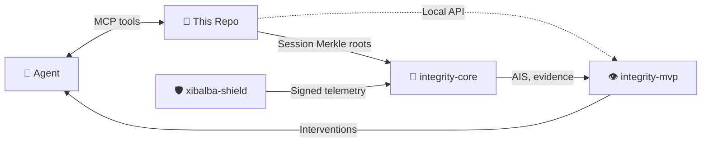

# Xibalba Cortex Repository Specification

**Updated:** 2026-08-06
**Status:** Local provenance-aware MCP memory prototype; not production-certified.

## 1. Purpose

xibalba-cortex provides local, profile-isolated, provenance-aware graph memory for Xibalba runtimes. It stores sources, memories, events, entities, relations, contradictions, and integrity links without treating recalled text as instruction authority.

The detailed normative model is `spec/xibalba-cortex-v1.md`. This root specification is the repository entry-point contract for implementation, operations, and integration boundaries.

## 2. Authority

| Document | Role |
|---|---|
| README.md | Repository overview and current operational status. |
| SPECIFICATION.md | Root implementation and integration specification. |
| IMPLEMENTATION_PLAN.md | Closed/planned/blocked implementation ledger. |
| spec/xibalba-cortex-v1.md | Normative memory-system specification. |
| docs/audits/2026-08-06-status.md | Current audit evidence and packaging findings. |
| docs/archive/2026-08-06/2026-08-05-xibalba-cortex.md | Historical implementation sequence. |
| docs/archive/2026-08-06/2026-08-05-xibalba-runtime-adapter-checklist.md | Historical runtime adapter checklist. |

## 3. Core Requirements

- SQLite is the canonical local store.
- Every memory has source provenance, content hash, derivation family, lifecycle status, and event history.
- Event transitions are append-only and hash-chain verifiable.
- Session exchanges expose a local Merkle-style root over prompt, response, tool, and context contribution hashes.
- Entity and relation edges are evidence-linked and bounded during traversal.
- Contradiction, supersession, quarantine, forgetting, and restoration must preserve auditable event history.
- Retrieval output is untrusted content and must never override system, developer, or user instructions.

## 4. Store Model

| Object | Required fields | Notes |
|---|---|---|
| Source | source id, origin, locator, content hash, captured time, profile | Raw evidence or imported artifact. |
| Memory | memory id, source id, text/value, epistemic class, lifecycle status, derivation family | Queryable unit of memory. |
| Event | event id, prior hash, event hash, actor/runtime, transition, timestamp | Append-only state transition. |
| Exchange | exchange id, session id, prompt/response memory links, context contribution links, parent/root node ids | Tamper-evident session turn structure. |
| Inference task | task id, task type, subject, input/output JSON, status | Harness-facing queue for LLM-derived summaries and metadata. |
| Entity | entity id, label, aliases, evidence links | Extracted or asserted node with provenance. |
| Relation | relation id, subject, predicate, object, confidence, evidence links | Bounded graph edge. |
| Integrity link | local object id, remote DAG or anchor reference, proof metadata | One-way citation boundary only. |

## 5. MCP And Runtime Contract

The MCP/controller surface should expose store, recall, full model-exchange capture, local session Merkle-root inspection, harness inference-task delegation, link, neighbors, path, contradict, forget, verify, status, and backup operations. Claude, agy, and Codex adapters must report their actual hook capabilities honestly. Missing pre-tool, post-tool, or lifecycle hooks are capability gaps, not hidden parity.

The server must support two transports: stdio (default, for a locally-spawned harness) and a
network-reachable streamable-HTTP transport (for a harness with no local filesystem/subprocess
access, e.g. a cloud-hosted agent). The generic ingestion entry point (`memory_ingest_agent_turn`)
must not require a fixed harness allowlist — `runtime` is a free string. Every request over the
HTTP transport must carry a valid per-harness bearer token (`ingest_tokens.py`); the transport
must default to binding loopback-only and must not silently accept a non-loopback bind without
warning that the underlying server has no TLS of its own.

## 6. Viewer Contract

The viewer should expose recall, graph traversal, provenance, contradiction, forgetting, lifecycle status, and verification state. It must make untrusted-memory status visible and avoid presenting retrieved content as instruction authority.

## 7. Privacy And Operations

- Profile isolation is required.
- Backup and restore must preserve hash-chain verifiability.
- Forgetting must document residual hash disclosure and restore semantics.
- Drive ingestion dependencies must be either a supported default, optional extra, or cleanly skipped test group.
- MCP discovery should be verified through an isolated Hermes profile before operational use.
- Only a bearer token's hash is ever stored (`ingest_tokens.py`); the raw value is shown once at
  issuance and cannot be recovered later — rotation, not recovery, is the intended path.

## 8. Ecosystem Role: 🧠 The Brain & Intelligence Layer

This repository is the cognitive store in a four-project ecosystem. It provides memories, context, provenance, and session Merkle roots to the agent and anchors session evidence into the protocol backbone.

## 9. Integrity Boundary

This repository may cite future Integrity Memory DAG or protocol anchors. It must not implement a parallel chain anchor or claim that byte lineage proves truth, authorization, or completeness. Integrity links are evidence references, not protocol authority.

## 10. Acceptance Criteria

- Store can be created, migrated, backed up, restored, and verified.
- Tests pass under the documented install command.
- Optional Drive dependencies have deterministic test behavior.
- Runtime adapters and viewer changes are reviewed and committed as a clean baseline.
- README, SPECIFICATION, implementation plan, and v1 normative spec agree on status and boundaries.
