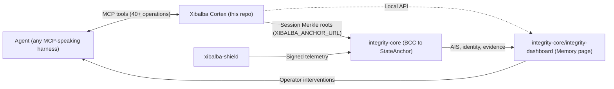

## Table of contents

- [Cortex is a standalone product first](#cortex-is-a-standalone-product-first)
- [Role: 🧠 The Brain](#role-the-brain)
- [Inbound: any agent, not just Xibalba runtimes](#inbound-any-agent-not-just-xibalba-runtimes)
- [Outbound: to the Backbone (integrity-core)](#outbound-to-the-backbone-integrity-core)
- [Outbound: to the Control Center (integrity-core/integrity-dashboard)](#outbound-to-the-control-center-integrity-core-integrity-dashboard)
- [Related pages in sibling repos](#related-pages-in-sibling-repos)

## Cortex is a standalone product first

Xibalba Cortex works as a generic MCP memory server with **any** MCP-speaking agent harness —
Claude Code, Codex, Google Antigravity CLI, cloud-hosted agents via
[Generic Ingestion](../concepts/generic-ingestion.md) — not something that only functions bolted
onto the rest of the Xibalba ecosystem. Store/recall, full model-exchange capture, session
Merkle-root verification, entity/relation graph traversal, and contradiction/lifecycle
management are all real MCP tools that work with zero dependency on any other repository (see
[MCP Tool Surface](../concepts/mcp-tool-surface.md)). The ecosystem integration described below
is additive value on top of a product that is complete on its own.

## Role: 🧠 The Brain

This repository is the cognitive store in a three-repository ecosystem. (`integrity-dashboard` —
the operator presentation layer, previously developed as a separate `integrity-mvp` repository —
now lives inside `integrity-core` as a component, not a fourth sibling repository.)

| Repository | Analogy | Role |
|---|---|---|
| `xibalba-cortex` | 🧠 The Brain | Local cognitive store — memories, context, reasoning provenance, session Merkle roots |
| `xibalba-shield` | 🛡️ The Immune System | Endpoint enforcement, kernel sensing, policy gating, semantic guardrails |
| `integrity-core` | 🦴 The Unifying Backend + 👁️ Control Center | Protocol backbone — on-chain identity, BCC, Oracle scoring, smart contracts — plus `integrity-dashboard/`, the operator presentation layer |

## Inbound: any agent, not just Xibalba runtimes

Agents read and write prompts, context, and memories via the MCP tool surface. The three
officially-adapted runtimes (`claude`, `agy`, `codex`) get a richer identity/policy layer — see
[Runtime Adapters](../concepts/runtime-adapters.md) — but that layer is opt-in, not a gate: a
harness with no dedicated adapter still works fully through the generic store tools and
[Generic Ingestion](../concepts/generic-ingestion.md)'s `memory_ingest_agent_turn`.

## Outbound: to the Backbone (integrity-core)

Session Merkle roots (see [Hash Chain and Merkle Roots](../concepts/hash-chain-and-merkle-roots.md))
can be anchored to integrity-core's BCC middleware via the `XIBALBA_ANCHOR_URL` environment
variable. Anchoring is triggered manually via the `memory_anchor_session_root` MCP tool, or
automatically on session close by setting `XIBALBA_AUTO_ANCHOR_ON_SESSION_END=1` — the runtime
controller then calls `anchor_session_root()` during `close_session()`, with anchor failures
handled gracefully so they never block session teardown. This anchoring is opt-in: a local hash
chain alone is tamper-evident locally but is not cryptographic proof to a third party until
anchored — see [Compliance Evidence Trail](../queries/compliance-evidence-trail.md).

## Outbound: to the Control Center (integrity-core/integrity-dashboard)

The local viewer and HTTP API surface memory, provenance, and integrity state that
`integrity-core`'s `integrity-dashboard/` component renders in its Memory page. This is a read
surface, not a dependency Cortex needs to function.

## Related pages in sibling repos

- xibalba-shield's own ecosystem-role page:
  [`xibalba-shield` wiki — Ecosystem Role](https://github.com/XibalbaTechSol/xibalba-shield/wiki/ecosystem-role)
- integrity-core's canonical cross-repository ownership boundaries:
  [`integrity-core/docs/architecture/ecosystem-dependencies.md`](https://github.com/XibalbaTechSol/integrity-core/blob/main/docs/architecture/ecosystem-dependencies.md)

See [Store Schema Overview](store-schema-overview.md) for the schema underlying everything
described here.
