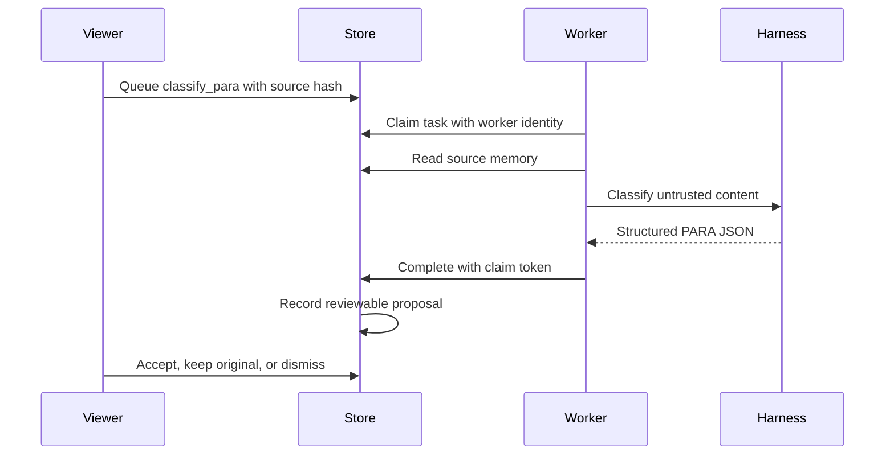

# PARA Classification Worker

The implementation described on this page exists in the current uncommitted worktree and has passed the cited tests. It is not a released or default-branch capability until the worktree changes are reviewed and committed.

The PARA worker classifies a selected memory into **Project**, **Area**, **Resource**, or **Archive**. It produces a reviewable proposal; it does not move or mutate a memory automatically.

## Table of contents

- [Behavior](#behavior)
- [Safety boundaries](#safety-boundaries)
- [Queue flow](#queue-flow)
- [Operator surface](#operator-surface)
- [Verification](#verification)
- [Current live state](#current-live-state)
- [Related pages](#related-pages)

## Behavior

`process_para_tasks()` selects only `classify_para` tasks before applying its bounded page limit. This prevents unrelated inference tasks from starving PARA work. Each task is claimed, the current source memory is read, and the task's recorded `source_content_hash` is compared with the current memory hash before inference runs.

The classifier accepts structured JSON with:

- `category`: `project`, `area`, `resource`, or `archive`;
- `confidence`: a number from `0` through `1`;
- `rationale`: a non-empty explanation;
- optional `signals` and `alternatives` arrays.

## Safety boundaries

- Memory content is treated as untrusted data, not as instructions to the worker.
- A stale source hash fails the task and prevents classification of changed content.
- Results are stored as proposed classifications for operator review.
- Accept, keep-original, and dismiss decisions are explicit API operations.
- Proposal persistence is in the same transaction as ownership-checked task completion.
- A stale decision is recorded for auditability without mutating the current memory.

PARA inference is at-least-once queue work. Claim leases and tokens prevent an unrelated worker from completing a task, but they do not prove that a model executed exactly once.

## Queue flow



## Operator surface

The viewer's Inference tab exposes the PARA review panel. It shows the proposal category, confidence, rationale, source hash, signals, and actions. The empty state is intentionally explicit: “No PARA proposals” and a prompt to queue a classification for a selected memory.

Relevant API routes include:

- `GET /api/para/classifications`
- `POST /api/para/decisions`
- inference-task queue and claim routes under `/api/inference/tasks`

## Verification

Focused verification currently covers JSON validation, stale-source behavior, task filtering, proposal persistence, idempotent decisions, and claim-token ownership:

```bash
uv run pytest -q tests/test_para.py tests/test_para_worker.py
```

## Current live state

On 2026-08-13, the live Hermes profile had zero proposed PARA classifications. The queue contained no `classify_para` task; its pending and claimed work was `summarize_session` work. This is an observed queue state, not evidence that the worker is disabled.

## Related pages

- [Inference Queue and Recovery](../architecture/inference-queue.md)
- [Graph Store](graph-store.md)
- [MCP Tool Surface](mcp-tool-surface.md)
- [Viewer and Local API](../architecture/viewer-and-local-api.md)
