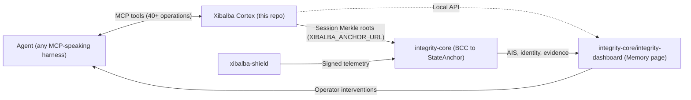

# Xibalba Cortex Wiki

Compiled knowledge base for **Xibalba Cortex** — a local, profile-isolated, provenance-aware
graph memory Model Context Protocol (MCP) server. It stores sources, memories, hash-chained
events, session exchanges, entities, and relations, and exposes them to any MCP-speaking agent
harness without ever treating recalled text as instruction authority. Governance/conventions:
`WIKI_SCHEMA.md` (page format), `WIKI_INDEX.md` (the full catalog with one-line descriptions —
the canonical index this page summarizes), `WIKI_LOG.md` (chronological history, append-only).
Cross-package decisions live in `../../SPECIFICATION.md`.

**Start here** if you're new: [Graph Store](concepts/graph-store.md) (the object model and
canonical SQLite store), then [Hash Chain and Merkle Roots](concepts/hash-chain-and-merkle-roots.md)
(how tamper evidence works), then [MCP Tool Surface](concepts/mcp-tool-surface.md) (how an agent
actually talks to the store), then [Generic Ingestion](concepts/generic-ingestion.md) (how any
harness — local or cloud-hosted — can use it, not just the three officially-adapted runtimes).

## System at a glance

## Table of contents

### Concepts
- [Graph Store](concepts/graph-store.md) — the canonical SQLite store and its object model
- [Hash Chain and Merkle Roots](concepts/hash-chain-and-merkle-roots.md) — the per-memory event chain and session exchange Merkle root
- [MCP Tool Surface](concepts/mcp-tool-surface.md) — the ~40+ MCP tools and two transports
- [Runtime Adapters](concepts/runtime-adapters.md) — the claude/agy/codex identity+policy layer
- [Generic Ingestion](concepts/generic-ingestion.md) — `memory_ingest_agent_turn`, streamable-HTTP, bearer tokens
- [Redaction](concepts/redaction.md) — shared secret-scrubbing logic
- [Lifecycle and Forgetting](concepts/lifecycle-and-forgetting.md) — memory states, contradiction, supersession, forgetting

### Entities
- [Sessions and Exchanges](entities/sessions-and-exchanges.md) — session turn structure and Merkle chaining
- [Entities and Relations](entities/entities-and-relations.md) — the bounded graph and its traversal
- [Ingest Tokens](entities/ingest-tokens.md) — per-harness bearer-token credential store

### Architecture
- [Ecosystem Role](architecture/ecosystem-role.md) — Cortex as 🧠 The Brain, and as a standalone product first
- [Store Schema Overview](architecture/store-schema-overview.md) — a schema-level tour of every table

### Open queries
- [Compliance Evidence Trail](queries/compliance-evidence-trail.md) — how far Cortex's queryable history goes toward compliance-grade evidence

### Reference
- [WIKI_INDEX.md](WIKI_INDEX.md) — full catalog, one-line description per page (the canonical index)
- [WIKI_LOG.md](WIKI_LOG.md) — chronological record of every wiki change, append-only
- [WIKI_SCHEMA.md](WIKI_SCHEMA.md) — page format, frontmatter, tag taxonomy

## No aspirational content

Every page here documents what exists in the code right now. A feature described in a spec but
not yet implemented is explicitly marked `[PLANNED]` in its title/index entry — never written as
if it's real. See `WIKI_SCHEMA.md` for the full convention.
